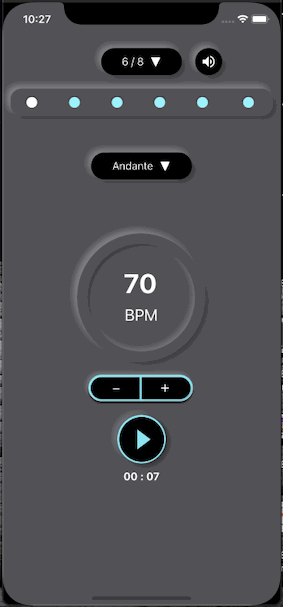

# My Metronome

MyMetronome is a lightweight metronome app. It shows glowing animation at every beat, and uses white glowing to distinguish the first beat of a measure from the rest. Any change in time signature and tempo marking will be updated immediately.

The beat sounds is able be muted so that users can focus on the music they are playing, but still follow tempo through the glowing and beat dot visual effects.  

### Medium Articles

For more details about this app, please see Medium articles:
[[Swift]Metronome #1 Protocol & Delegate, Singleton](https://penny-huang.medium.com/swift-metronome-1-protocol-delegate-singleton-5f5db771c3f0)
[[Swift]Metronome #2 Custom UIButton 自訂有兩層陰影的Button](https://penny-huang.medium.com/swift-metronome-2-custom-uibutton-%E8%87%AA%E8%A8%82%E6%9C%89%E5%85%A9%E5%B1%A4%E9%99%B0%E5%BD%B1%E7%9A%84button-c5c258c01ef9)
[[Swift]Metronome #3 Glowing Animation發光動畫效果](https://penny-huang.medium.com/swift-metronome-3-glowing-animation%E7%99%BC%E5%85%89%E5%8B%95%E7%95%AB%E6%95%88%E6%9E%9C-adb0eac5fbf4)
[[Swift]Metronome #4 Popover 選取視窗, Google AdMob](https://penny-huang.medium.com/swift-metronome-4-popover-%E9%81%B8%E5%8F%96%E8%A6%96%E7%AA%97-google-admob-ac05fb0306de)

# Demo

Able to change the BPM through the plus and minus buttons, and also through the tempo marking selector.

Update the beats immediately when the time signature is changed

Able to mute the beat sounds

A Google Ad banner displayed at the bottom of the screen

